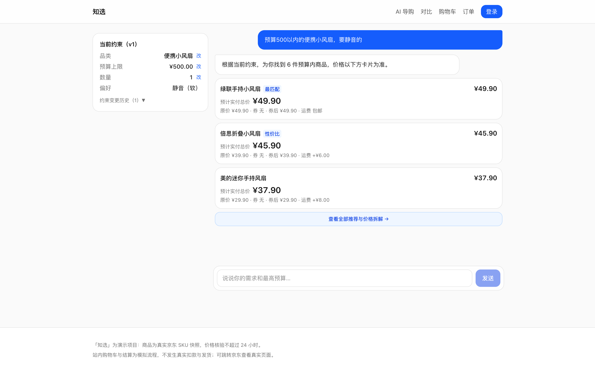
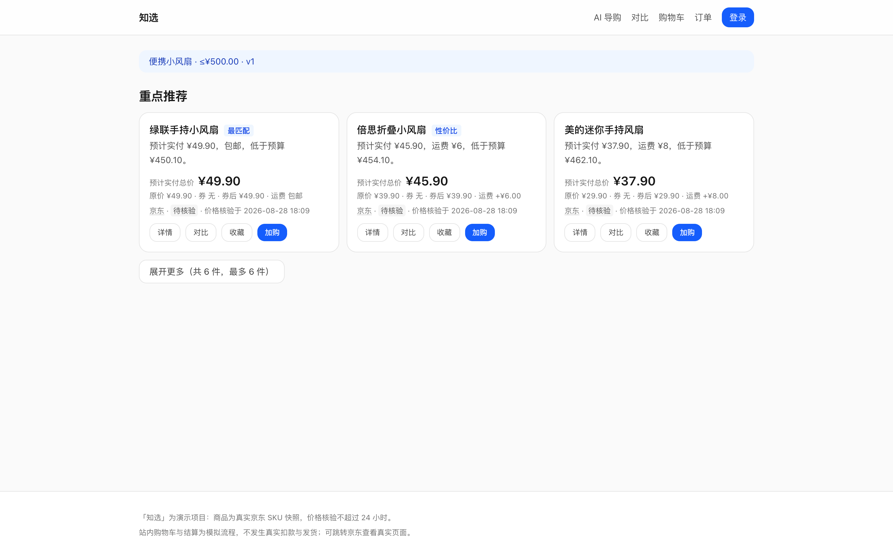
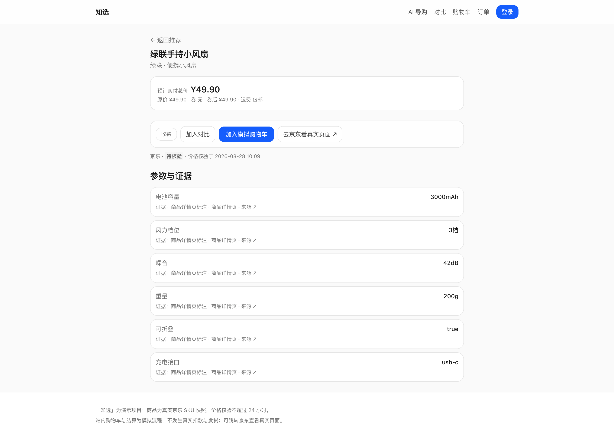
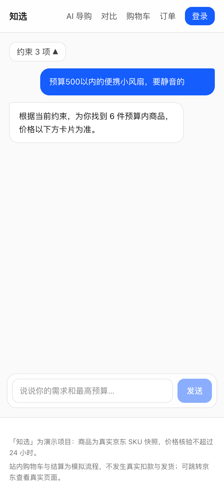
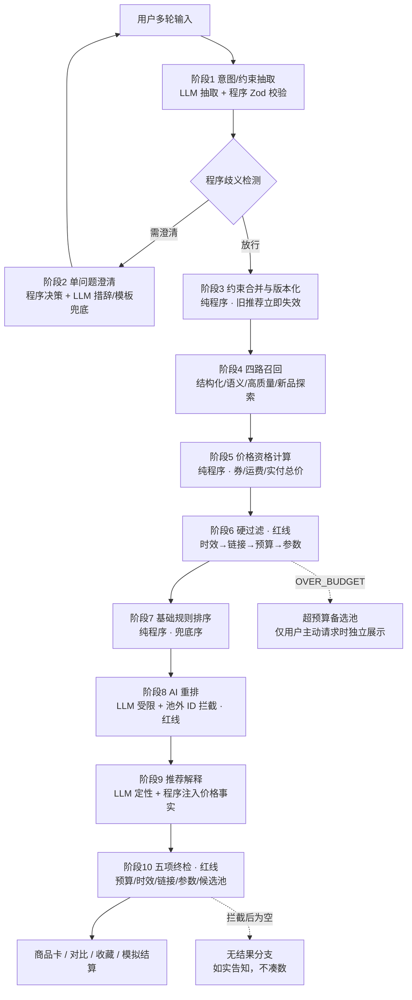

# 知选｜AI 导购（策略产品 Demo）

> 一句话：用户用自然语言说预算和需求，系统推荐商品并**保证不超预算**——这个保证由程序硬约束实现，不依赖大模型自觉。

🔗 **在线体验**：https://zhixuan-ai-shopping-guide.vercel.app （vercel.app 域名在国内需代理访问）

## 这个项目解决什么问题

来自两份前期调研的真实卡点（搜索推荐链路拆解 + 主流 AI 导购横向体验）：

| 调研发现的卡点 | 本项目策略 |
|---|---|
| **预算约束不被遵守**：说了预算仍推荐超价商品 | 预算硬约束：实付总价 =（单价−券）×数量+运费，程序计算与过滤，LLM 无权参与价格判断 |
| **价格口径不透明**：看着便宜、下单变贵 | 五项价格拆解逐项展示；条件券在用户确认前不计入价格 |
| **条件在多轮对话中丢失**：改了预算还推旧结果 | 约束版本化：变更即生成新版本，旧推荐立即失效不可下单，可撤销到任意历史版本 |
| **商品参数无证据来源**：AI 说的参数不敢信 | 参数带证据字段；解释中禁止 LLM 产出数字，数字全部由程序注入（出现即丢弃回退模板） |

核心设计原则：**LLM 负责理解和表达，程序负责事实和硬约束**。

## 产品截图

### 对话式导购（多轮需求理解 + 内嵌推荐卡）

### 推荐结果页（五项价格拆解，数字可核对）

### 商品详情页

### 移动端

## 搜推链路图

## 三条不可配置红线

策略层不暴露开关，任何情况下都成立：

1. **预算硬过滤**：预计实付总价 ≤ 预算上限，整数分计算，无浮点误差
2. **候选池边界**：AI 重排只能返回池内 ID，池外 ID 程序拦截丢弃
3. **输出终检**：每件推荐在输出前重新校验预算/时效/链接/参数

配套护栏：宁可如实告知"预算内没有合规商品"，也不放松约束凑数（无结果分支）；LLM 不可用时三级降级（主模型 → 备用模型 → 规则兜底），降级路径同样过全部红线。

## 验证方式

- **离线评测集**：108 条查询（100 单轮 + 8 多轮），预算合规率 329/329
- **单元测试**：130 个用例覆盖引擎各阶段
- **全链路 trace**：每次推荐记录召回/定价/过滤/排序/重排/终检六段轨迹，可在后台审计
- **降级路径实测**：上述指标在规则兜底路径上同样达成，证明不依赖 LLM 可用性

## 技术栈

Next.js 16 · React 19 · Supabase（Postgres + RLS + 匿名登录）· Kimi API（降级：OpenRouter → 规则兜底）· Vercel

## 诚实边界

- 商品库为 48 个演示占位 SKU（结构按真实京东商品建模，正式使用前需人工核验替换）
- 结算为明确标注的模拟流程，不发生真实扣款
- 源码仓库暂为私有，本仓库仅作产品介绍
